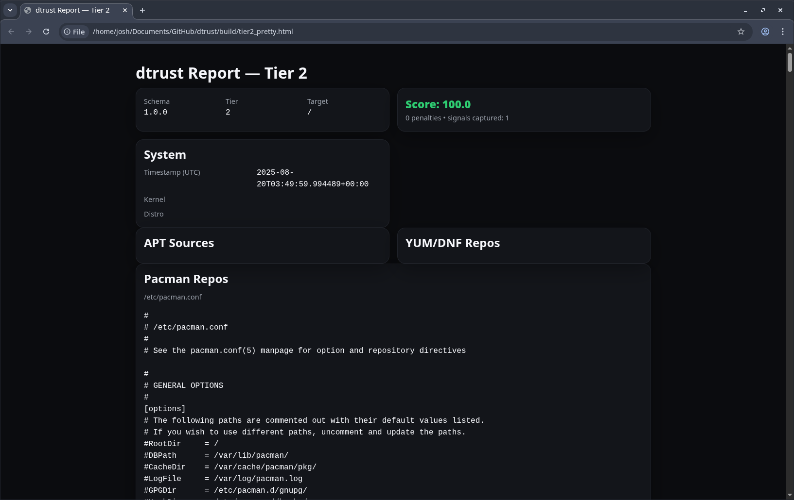

# DistroTrust (dtrust)

[](./LICENSE)


# DistroTrust

DistroTrust is a tool for scanning a Linux root filesystem and collecting trust signals. It generates structured JSON reports which can then be scored and rendered into readable Markdown or HTML. These reports help assess how much trust you can place in a given Linux distribution or installation.

I originally created this project after releasing a review of [`AnduinOS`](https://github.com/Anduin2017/AnduinOS) that received negative community feedback. The video is [`here`](https://www.youtube.com/watch?v=G9fC_mS0g6I).

Some viewers expressed strong distrust toward the distro, suggesting it might contain spyware or hidden telemetry simply because it was built by a Chinese developer.  
Comments included:  

- *"I wonder if it is telemetry inside hidden? Just investigating to see if it's free from spy or spying?"*  
- *"Oh please... do your research before posting a video like this. This distro is made by a Chinese guy who works for Microsoft in CHINESE. (It's a CHINESE DISTRO!!!)"*  
- *"It's a one man distro and it's made by a young twenty something year old - There is no way in hell I would trust this guy OR this distro."*  

Rather than speculate, I wanted a **technical way to measure trustworthiness**.  
DistroTrust was built to provide that: a structured, reproducible scan of package sources, repository configurations, path collisions, and other signals that impact how much you can trust a Linux distribution.

---

## Quick Start

```bash
# 1. Clone and enter the repo
git clone https://github.com/keepittechie/dtrust.git
cd dtrust

# 2. Run a Tier-2 scan on your root filesystem
python3 dtrust_cli.py --tier 2 --rootfs / --out build/tier2.json

# 3. Score + render the results
python3 score-dtrust-report.py build/tier2.json > build/tier2.score.json
python3 render_pretty.py --in build/tier2.json --out build/tier2_pretty.html --score build/tier2.score.json

# 4. Open the final report
xdg-open build/tier2_pretty.html
````

---

## What it does

* **Tier 1** – Collects base information such as distribution metadata.
* **Tier 2** – Adds repository definitions (`apt`, `yum/dnf`, `pacman`), path shadowing (duplicate binaries across directories), and manual areas of interest (`/usr/local`, `/opt`).
* Higher tiers (planned) will include even more checks.

The output can be scored for consistency and rendered into a clean HTML report for inspection.

---

## Installation

Clone the repo and install the minimal dependencies:

```bash
git clone https://github.com/keepittechie/dtrust.git
cd dtrust
python3 -m venv venv
source venv/bin/activate
pip install -r requirements.txt
```

---

## Usage

Run directly with Python:

```bash
# Tier 1
python3 dtrust_cli.py --tier 1 --rootfs / --out build/report.json

# Tier 2
python3 dtrust_cli.py --tier 2 --rootfs / --out build/tier2.json
```

Score and render the reports:

```bash
python3 score-dtrust-report.py build/tier2.json > build/tier2.score.json
python3 render_pretty.py --in build/tier2.json --out build/tier2_pretty.html --score build/tier2.score.json
```

Open `build/tier2_pretty.html` in your browser to view the results.

---

## Using `make`

This project ships with a **Makefile** so you don’t need to type long commands manually.
`make` is a build automation tool: each **target** is a named recipe that runs shell commands.

Common targets:

* `make tier1` – Collect Tier-1 signals → `build/report.json`
* `make tier2` – Collect Tier-2 signals → `build/tier2.json`
* `make score-json1` / `make score-json2` – Score the Tier-1 or Tier-2 reports
* `make render_pretty1` / `make render_pretty2` – Render polished HTML reports

For example:

```bash
make tier2
make score-json2
make render_pretty2
```

Then open:

```bash
xdg-open build/tier2_pretty.html
```

---

## Makefile Commands

You can also run:

```bash
make
```

This is shorthand for generating reports defined in the **Makefile**.
It automates validation, scoring, and rendering — so instead of multiple commands, you just run one.

---

## Example Output

Here’s what a Tier 2 HTML report looks like:



---

## Contributing

Contributions are welcome!

1. Fork the repo
2. Create a feature branch:

   ```bash
   git checkout -b feature/my-improvement
   ```
3. Make your changes
4. Commit and push:

   ```bash
   git commit -m "Add my improvement"
   git push origin feature/my-improvement
   ```
5. Open a Pull Request

I definitely welcome:

* New collectors for other distros.
* Bug fixes in repo parsing.
* Enhancements to the scoring model.
* Documentation improvements.

---

## Example Reports

Sample Tier-2 reports are included under [`dtrust/examples`](./dtrust/examples) for Ubuntu, Rocky Linux, and AnduinOS.
You can compare them with your own distribution scans.

---

## Project Structure

```
.
├── build/                  # Generated reports (JSON, HTML, Markdown, scores) – not tracked in git
├── docs/                   # Documentation (schemas, guides)
├── examples/               # Golden examples and sample outputs for testing
├── scripts/                # Validation and helper scripts
├── templates/              # Report schemas, scoring rules, Jinja2 templates
├── dtrust_cli.py           # Main CLI entry point
├── render_pretty.py        # Converts raw reports to formatted HTML
├── render_jinja.py         # Jinja2 renderer (HTML/Markdown support)
├── render_report.py        # Alternative renderer for reports
├── score-dtrust-report.py  # Scoring logic for reports
├── Makefile                # Common tasks (build, test, clean)
├── README.md               # Project overview and usage guide
└── TODO.md                 # Notes and roadmap items
```

### Key Files

* **`dtrust_cli.py`** → Main CLI tool for generating Tier 1/2+ reports.
* **`render_pretty.py`** → Pretty-prints Tier 2 reports into HTML.
* **`score-dtrust-report.py`** → Applies scoring rules to generated reports.
* **`Makefile`** → Provides shortcuts (`make build`, `make test`, etc.).
* **`examples/`** → Known-good reports for regression testing.
* **`templates/`** → JSON schemas, scoring YAML, and HTML/Markdown templates.

---

## License

Licensed under the [Apache License, Version 2.0](./LICENSE).